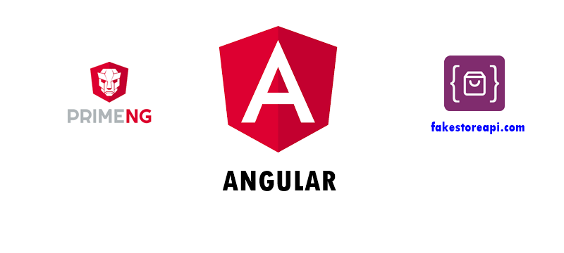
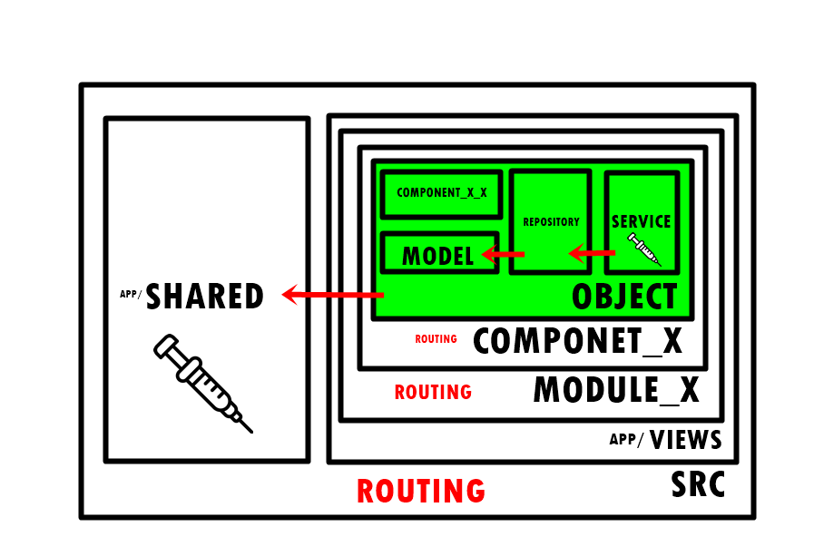

<h1 align="center"> FelipedelosH </h1>
 
<h4>Angular - Sakai CRUD from/to API</h4>

 
:construction: In Construction :construction:
 
I developed a project using Angular to consume the API from FakeStoreAPI. This project leverages Angular's powerful features to create a dynamic and responsive web application. Utilizing the PrimeNG library, I enhanced the user interface with rich and interactive components.

## :hammer:Funtions:

- `Function 1`: GET ALL PRODUCTS OF API https://fakestoreapi.com/products 
- `Function 2`: Make a CRUD funcion: "Create new peoject" 
- `Function 2`: Make a CRUD funcion: "Read all products" 
- `Function 2`: Make a CRUD funcion: "Update product" 
- `Function 2`: Make a CRUD funcion: "Delete product" 

# Architecture

# Sakai

This project was generated with [Angular CLI](https://github.com/angular/angular-cli) version 13.0.4.

primeng-v15-lts

## Development server

Run `ng serve` for a dev server. Navigate to `http://localhost:4200/`. The app will automatically reload if you change any of the source files.

## :play_or_pause_button:How to execute a project

GO TO: `http://localhost:4200/#/inventario/productos`

## :hammer_and_wrench:Tech.

- Angular
- PrimeNG

## :warning:Warning.

- generate views from https://www.primefaces.org/primeng-v15-lts/installation
- generate all interlan data from https://fakestoreapi.com/products

## Autor

| [ Andrés Felipe Hernánez](https://github.com/felipedelosh)|
| :---: |